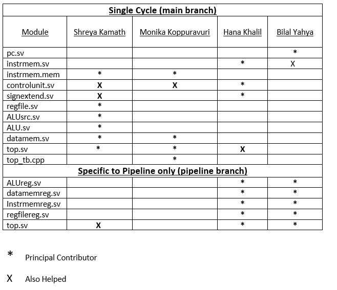

# Group 33 Statement

### Task 1- Single Cycle CPU

Our team has completed the single-cycle RISC-V design that successfully demonstrates an f1 light sequence display implemented by assembly language written from addi, bne, slli, jal and jalr instructions.

The single-cycle design has also been tested against the reference program with the additional instructions implemented in the control unit and other sheets. All of the given distributions are accurately displayed on the Vbuddy with changes made in the testbench (top_tb.cpp) to ensure the program compiles in an appropriate amount of time.

Code to run the f1 light sequence for the single cycle CPU is found on the main branch in a folder called f1.

Code to run the reference program for the single cycle CPU is found on the main branch in a folder called rtl.

Src folders on the main branch have been generated to view the hexfiles of each.

| Single Cycle CPU  | Main Branch |
| ----------------- | ----------- |
| F1 light sequence | f1 folder   |
| Reference Program | rtl folder  |

### Working Single Cycle
**F1 Single Cycle**

https://user-images.githubusercontent.com/116266163/208171747-6959beb7-5256-44db-a14d-b0862477fbad.mp4

**Gaussian Single Cycle**

https://user-images.githubusercontent.com/116266163/208172075-d1b3a95f-fc02-420f-b83d-59023f59a31d.mp4

**Noisy Single Cycle**

https://user-images.githubusercontent.com/116266163/208173596-1db0e649-d105-4527-a7db-20cb92e30b7a.mp4

**SignMem Single Cycle**

https://user-images.githubusercontent.com/116266163/208173666-ec6fe4a8-78f1-475f-9986-83ea34d08281.mp4

**TriangleMem Single Cycle**

https://user-images.githubusercontent.com/116266163/208173715-5b4dbf0d-8cd5-4fdb-8251-9118fbb4e06e.mp4

### Extension 1 - Pipelined CPU

Our team has also completed the pipelined design, by adding registers and their corresponding wires to the CPU. This executed the pipeline process as the assembly code executes the instruction with one cycle delay between each execution. With this implementation, we programmed the CPU to successfully display an f1 light sequence using an adjusted assembly language where nops were included between the instructions to account for any hazards. We then altered the CPU to include more instructions for the refernce program. These files are in the "piped" branch. (this may be called "pipelining" on your local device on github desktop.)

**pipelining - branch explained**

In this branch there are 3 folders: f1_pipelining_working, reference_pipeline, and pipeline_cu_changed.

**f1_pipelining_working**

This folder contains the pipelined CPU that works for the f1 sequence assembly code. However, after achieving this we realised we have many instructions missing in the control unit. 

**reference_pipeline**

In this folder we copied and pasted our complete control unit, sign extend from the single cycle and adjusted top.sv. However, when we did this the reference programme would not work. We spent a long time debugging however, we ran out of time and realised we may be able to achieve the complete pipeline if we completely change the control unit.

**pipeline_cu_changed**

In this folder we changed the control unit completely. We debugged the whole CPU, trying our best to make it work. This is the most up to date pipelined cpu for the reference code.

### Working Pipelined CPU

**F1 Pipelined**

https://user-images.githubusercontent.com/116266163/208174068-63e89df2-7a43-47d4-a1d4-06cb515b9e0b.mp4

### Group contributions

Bilal was responsible for designing the PC module as well as work towards creating the
pipelined versions together with Hana by making the additional registers and
wiring the pipline sheets.

Hana worked on the control unit block which included the instruction memory and sign extend
unit. She also worked with Bilal to create the pipelined sheets and wire them
together.

Shreya was in charge of designing the ALU module which included the register file, ALU and
certain control signals as well as the data memory block. She worked towards
creating the assembly language for the f1 light sequence with Monika.

Monika, along with helping create the assembly language and data memory, also worked on
the top sheet to wire up components and finally complete testing and debugging
with the testbench.

### Reflections

Our team was very collaborative and helped each other consistently throughout the process,
therefore we all have good knowledge about each aspect of the processor.

We really enjoyed working together and learning from each other.

Using this experience, moving forwards for the next project we agree that we should have found a better way to split the project equally and allocate work more fairly by spending time to understand the objectives and realise what work needs to be done in what order.

We found that sometimes naming conventions for variables were not followed making the debugging difficult. We did consider this issue and spent time creating more meaningful variable names using _in and _out attachments for ease in wiring.

We are also aware that our git commit messages could've been written better, however, we are proud of ourselves for all using git/github successfully for the first time.
