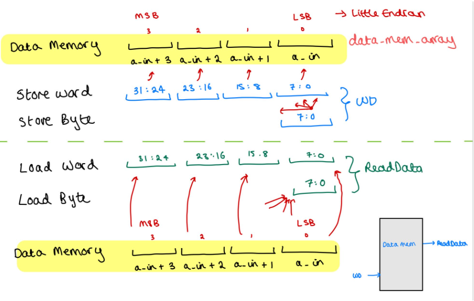
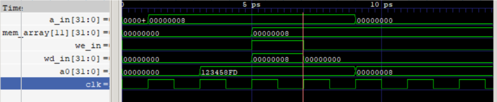

# Shreya Kamath Personal Statement

## Intro

In this project I learnt a lot about the RISC-V 32 bit integer instruction set and how to implement a single-cycle instruction set in a microarchitecture and its pipelined extension.  I made significant contribution to building the blocks highlighted in green, with large contributions to the blocks highlighted in yellow in the image below.  I did some work  wiring control signals in the pipelined extension.

I tried my best to follow good practices by keeping variable names that follow the schematic and keep meaningful commit messages.

## regfile.sv

I built this file keeping its features simple - [Lab 4 design](https://github.com/EIE2-IAC-Labs/iac-riscv-cw-33/commit/701641e29957caab56bd4089be465ea88c0a4b2d#diff-126540eeb309fc07577839cb956b8e6ffdf280d17e74256a593fe72c7ad8d4d3). Writing to registers is synchronous and therefore was done on the positive edge of each clock cycle via an always_ff.  I made the decision to include the [conditional statement](https://github.com/EIE2-IAC-Labs/iac-riscv-cw-33/commit/ae9c3345a7542337f365c612e1d086ae7871071e) (rd_in != 0) to ensure register 0 was never overwritten.

Reading values from registers is asynchronous. Combinational logic was used to pass the values in register 10 to the output signal a0 (which stores the return value). Output values  from the register block (rd1/rd2) )are forced to take stored register values specified by rs1/rs1.  All of these features create a [fully functional register file](https://github.com/EIE2-IAC-Labs/iac-riscv-cw-33/commit/465fbbe5d427886b14c12e1a362f45d825842abc).

An improvement would be to include a reset function as registers could be undefined if not initialised properly in other purposes.

## ALU.sv

I built the [initial version](https://github.com/EIE2-IAC-Labs/iac-riscv-cw-33/commit/701641e29957caab56bd4089be465ea88c0a4b2d#diff-126540eeb309fc07577839cb956b8e6ffdf280d17e74256a593fe72c7ad8d4d3) of this file to include add and shift as these were the instructions needed to run the F1 light sequence and reference program.

The design choice of a case block using a 3-bit ALU control signal allowed for the ability to include many different arithmetic/logic instructions when needed. The EQ output is always checking the values of ALUop1 and ALUop2 and is only 1 when the two are equal. From building this block, I learnt how useful case statements can be when selecting between multiple different options and how intuitive control signals are to provide this.

I created a separate sheet for the [ALUsrc](https://github.com/EIE2-IAC-Labs/iac-riscv-cw-33/commit/701641e29957caab56bd4089be465ea88c0a4b2d#diff-126540eeb309fc07577839cb956b8e6ffdf280d17e74256a593fe72c7ad8d4d3) as I felt in terms of inputs and outputs that the wiring would be quite straightforward and would lead to a simpler ALU sheet. However, to reduce the number of sheets, this very easily could have been implemented in the ALU as it is only a 1 line multiplexer and would perhaps have been more efficient and self-contained.

## datamem.sv

I built this sheet with Monika. The memory was mapped to the appropriate space according to the memory map in the project brief. Values were loaded in from datamem.mem into the specified data memory array.

Byte addressing was used meaning a full word was processed from 4 bytes in data memory via little endian. The diagram above helps to explain the design implemented.

My design strategy to pick between storing/loading words or bytes involved using an additional control signal called addr_mode. This was specified in the control unit according to the instruction to determine the addressing mode.

|                   | Addr_mode = 0 | Addr_mode = 1 |
| ----------------- | ------------- | ------------- |
| Write_enable = 0 | Load word     | Load byte     |
| Write_enable = 1 | Store word    | Store byte    |

Storing values in memory is synchronous, therefore was done through an always_ff clocked unit. To [store a byte](https://github.com/EIE2-IAC-Labs/iac-riscv-cw-33/commit/516f42c5b750a966a98be258fbdecc7158254b24#diff-de32b8ddda48f52fb868dabedb1883f8d33a73fb4339b349a444e63af6e45036), both write enable and address mode must be on. The case signal used was the last two bits in the input address, a_in as this successfully differentiates between the 4 bytes in a word. The specified byte of the word in memory is then overwritten by the input byte data.

To [store a whole word](https://github.com/EIE2-IAC-Labs/iac-riscv-cw-33/commit/516f42c5b750a966a98be258fbdecc7158254b24#diff-de32b8ddda48f52fb868dabedb1883f8d33a73fb4339b349a444e63af6e45036), case logic is no longer required as all 4 bytes in the word in data memory needs to be overwritten with the corresponding 4 bytes of the input data word.

Reading from memory is asynchronous. Initially I used an always_comb block but for an unknown reason, which I would like to find out more about, there was a latch error and instead I replaced it with an always_latch. With the correct control signals, to [load a byte](https://github.com/EIE2-IAC-Labs/iac-riscv-cw-33/commit/7a7e4f816dab88852694652bca049ad19a6a74ab#diff-de32b8ddda48f52fb868dabedb1883f8d33a73fb4339b349a444e63af6e45036), again case was used with a_in[1:0] to pick the byte which was passed as output data to the register and stored there.

[Loading the full word ](https://github.com/EIE2-IAC-Labs/iac-riscv-cw-33/commit/7a7e4f816dab88852694652bca049ad19a6a74ab#diff-de32b8ddda48f52fb868dabedb1883f8d33a73fb4339b349a444e63af6e45036)involved assigning the correct byte of the output data to the corresponding byte from the memory. I found understanding the addressing quite difficult so made a few mistakes when initially assigning bytes between data memory and the read data output, however through running tests and drawing my diagram it became clear which direction the bytes were addressed in and where they should be assigned.

## top.sv

To wire up the correct data into the register file, I implemented a [result multiplexer](https://github.com/EIE2-IAC-Labs/iac-riscv-cw-33/commit/d46c49e57efdcfe0c76cad2a16af2563410b5707#diff-8e3776a859132803363f88ee4fc448067fc1422b00e44aacde1a8c8b36db5615) in the top sheet controlled by a ResultSrc signal which was correctly defined in the [control unit](https://github.com/EIE2-IAC-Labs/iac-riscv-cw-33/commit/8da51fed42d1f94cea1786e93910ded2fff730a1). This provided 4 outcomes one of which is passed to WD3 in the register file, the ALU result, the data memory output, PC + 4 or 24’b0 followed by a byte from data memory.

PC + 4 referred to a jal instructions so the register a1 could store the return address to link back to after completing the subroutine it branched to in the first place.  {{24’b0},(ReadData[7:0]}} concatenated 24 0’s with the byte for lbu instruction.

The older versions only assigned the next PC value to normal PC+4 incrementing or branching. To implement the jal and jalr instructions, it was important that the next PC value was edited to ensure the correct link out of a subroutine could occur.

A [next PC multiplexer](https://github.com/EIE2-IAC-Labs/iac-riscv-cw-33/commit/bb82da045d6134d7cf5ddc5c7c48fc845084b215#diff-8e3776a859132803363f88ee4fc448067fc1422b00e44aacde1a8c8b36db5615) was added in the top sheet controlled by the PCsrc signal generated in the control unit.

In the case of a jalr instruction, the result multiplexer passes (PC+4) into a register. Then in the PC multiplexer when a jalr instruction is reached, the result is taken out of the register passed through the result multiplexer and into the PC multiplexer input to ensure the correct PC is up next.

To improve the design of the top sheet, these multiplexers could have been implemented within an existing sheet or in their own sheet.

## signextend.sv

I assisted Hana by improving and updating the sign extend unit which was a simple multiplexer choosing between addi or bne, to now making the [ImmSrc control signal 3 bits](https://github.com/EIE2-IAC-Labs/iac-riscv-cw-33/commit/d9716310cacff338778f631240005666e58c423a) to accommodate for more instruction types to be sign extended using case statements as opposed to IF statements.
Case statements are faster which is why I decided to improve the design. I implemented the [jalr, jal and lui](https://github.com/EIE2-IAC-Labs/iac-riscv-cw-33/commit/2b4600f7616dba22acdfe9e518ece500034e92ae) by looking at their machine code instruction formats and extending the immediate parts to 32 bits.

Since our CPU doesn't implement all 48 instructions, we were not limited for space and therefore, some case statements had the same output. This could be refined to ensure each case outputs a single result and then edits can be made in the control unit to back this up.

## controlunit.sv

I assisted Hana by [extending and improving the control unit](https://github.com/EIE2-IAC-Labs/iac-riscv-cw-33/commit/be96b8ff9a49015df248d1f080bce583055c7d9d). I started by setting the control signals to a default of 0 for convenience and ordered the instructions by their type. I cleaned up the bne instruction by ensuring branching only happened when ALU inputs were equal, therefore I wired the EQ signal into the sheet.

I added SLLI, load word, load  byte unsigned, jalr, jal, add, lui, store word and store byte in order to cover the reference program. Each instruction was selected via its unique opcode and funct3, and appropriate control signals assigned.

For example:

Due to my additions of a result multiplexer, PC multiplexer and more sign extended instructions, I had to implement changes to the Resultsrc, PCsrc and [ImmSrc signal](https://github.com/EIE2-IAC-Labs/iac-riscv-cw-33/commit/bb82da045d6134d7cf5ddc5c7c48fc845084b215#diff-b0c3b78093c304d3c300e71a3011db4459453aedf5d68ddbc6a3ff93d9401ab1) widths and values to match up with other modules of the CPU.

To improve, the control signals could be selected via a case statement rather than IF statements as these are slower and will get worse as the instruction set increases. However, we were unsure of how to specifiy the unique opcode and funct3 into a case condition.

## instrmem.mem

I worked with Monika to create an [assembly language program](https://github.com/EIE2-IAC-Labs/iac-riscv-cw-33/commit/7a3ee60d085c16d56afe569a49494b1a4023bf7f#diff-b6a62016320e6672cf2c5d46377932744584d749cf1a574bfa13060fb3225a87) that used as few instructions as possible including jal and jalr to create an F1 light sequence display. Each light on the vbdbar switched on one by one using an FSM approach where each state had values assigned to a0 (1, 11, 111,….,11111111). After each light switched on, it was held by a delay loop to ensure it was on for a noticeable amount of time until the next light switched on. When the final light switched on, the delay loop would run once more to hold the value for a little while and then reach the finish loop. There, a0 is set to 0 at the reset state and the loop is infinite so will keep running until the clock cycles run out.

Evidence of the working display can be seen on the group statement README.md

## Tests and Debugging

After writing the main modules of the CPU and the rough instruction set was assembled, there were many issues which needed to be solved.

Monika and I worked towards fixing these by using gtkwave traceforms and display signals to decipher which instructions are causing issues and why.

### Tests:

An instance where we had to do tests was when we were implementing instructions into the control unit to see if the correct control signals had been set.

An example of a test is as follows:

To understand if the store word instruction worked, we first loaded the contents of register 8 into a0, stored the value 8 into a1 then stored 8 into register 8. If the store had worked correctly, then after loading register 8 into a0, the value 8 should emerge.

### Single-cycle:

##### F1:

* We realised the bne was not branching to the correct instruction as the PC value it branched to was offset by 1. After investigating how the branch worked, we realised it was in the sign extension where we hadn't specified bit 0 to be 0 and instead we had 21 bits of the most significant bit extended. After fixing the [sign extension](https://github.com/EIE2-IAC-Labs/iac-riscv-cw-33/blob/main/rtl/signextend.sv), the branch was correct.
* After the branch was fixed, the program ran successfully until the return statement (jalr) was reached. Lots of understanding went into figuring out how exactly jump and link worked for the
  subroutine to return to the next PC value. This prompted us to look further into our design and see how we can ensure register 1 (ra) was holding the correct value and wasn't overwritten. We realised there was no multiplexer choosing whether the ALU results, data memory values or next PC in the case of a jal instruction was in place. This led to the creation of the [result multiplexer](https://github.com/EIE2-IAC-Labs/iac-riscv-cw-33/commit/d46c49e57efdcfe0c76cad2a16af2563410b5707#diff-8e3776a859132803363f88ee4fc448067fc1422b00e44aacde1a8c8b36db5615) written in the top sheet which in turn led to the [next PC multiplexer](https://github.com/EIE2-IAC-Labs/iac-riscv-cw-33/commit/bb82da045d6134d7cf5ddc5c7c48fc845084b215#diff-8e3776a859132803363f88ee4fc448067fc1422b00e44aacde1a8c8b36db5615) needing to be wired to the result for the jalr. After making these changes it was clear that ra was holding the correct values for the correct duration!

##### Reference:

* Initially the datamem.sv file had major errors in regards to sb and lbu which were clear through tracing the waveforms. In the sinegen, the other instructions were working adequately until we realised the address was being overwritten with 0s and therefore, a0 was just reading 0s. We realised this was due to an error in sb as it was only writing the least significant byte and not the byte specified in the instruction. This prompted us to update the [datamem.sv](https://github.com/EIE2-IAC-Labs/iac-riscv-cw-33/blob/main/rtl/datamem.sv).

### Pipeline:

* I made some contributions to the pipelining of the top sheet after realising the datamem.sv, control unit and sign extension of the single-cycle CPU was not correct due to the store byte issues and therefore, the pipelined extension would also be incorrect. In the pipelining branch I had to wire the additional control signal (addr_mode) from the control unit, through two registers and into the data mem as well as fix other signals/sheets and edit them all in the top sheet. This gave me a good understanding of the operation of the pipelined CPU.

## Reflections

**What I have learnt:** 

* From writing the assembly language and having to go into detail over the machine code and instruction formats of different instructions due to debugging purposes, I have a solid understanding of the RISC-V 32 bit integer instruction set architecture.
* I have become a lot more knowledgeable in what to look out for when debugging and how to utilise waveforms and display signals to trace the signal.
* My contributions mainly built the foundations and upgraded features of the single-cycle CPU providing me with a sound understanding of the RV32I instruction set in a microarchitecture.
* My understading of the commands in system verilog and how it works has also improved significantly.

**Mistakes made:** 

* Working with Git for the first time caused a few issues as sometimes I would forget to pull before pushing leading to conflicts which were difficult to resolve and wasted time.  I tried to keep this in mind and created new branches for the team to work on.
* I sometimes mixed up the use of non-blocking assignments in non clocked units which led to errors. Now I have learnt from this and am aware that they can only be used in clocked settings.

**Looking ahead:**

Throughout this statement I haved talked about my contribution in detail about the design decisions made.

- If I were to have more time I would like to implement all 48 instructions for a complete CPU and use 4 bit ALU encoding to allow for more instruction operations.
- I am also keen to look into the data cache and how it can be implemented, I will be doing this in my own time in the future.
- If I were to do this project again, I would make sure to keep track of my progress and keep evidence such as screenshots of waveforms as I go along in order to see what mistakes I made and evaluate on them in the future.
